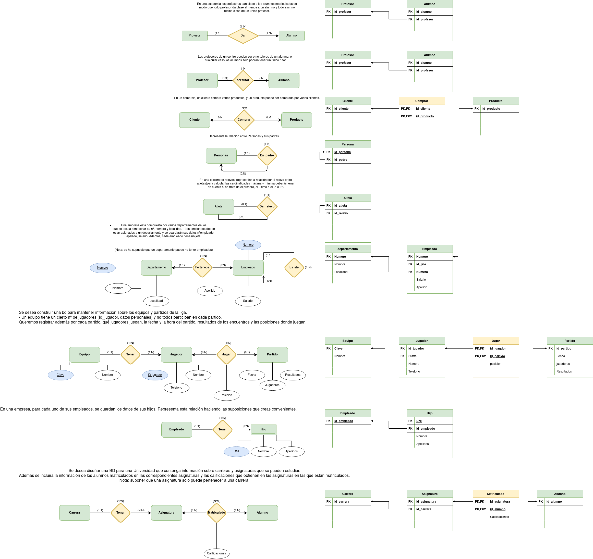
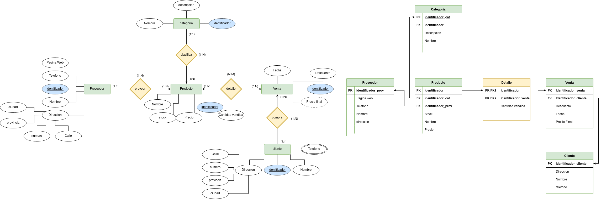
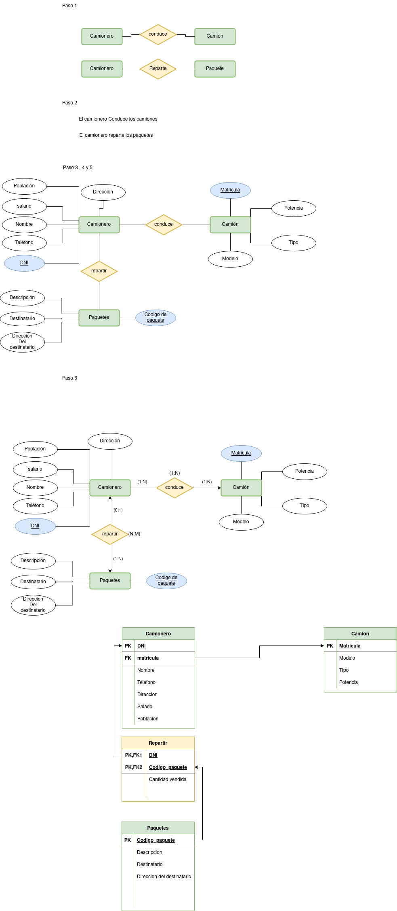
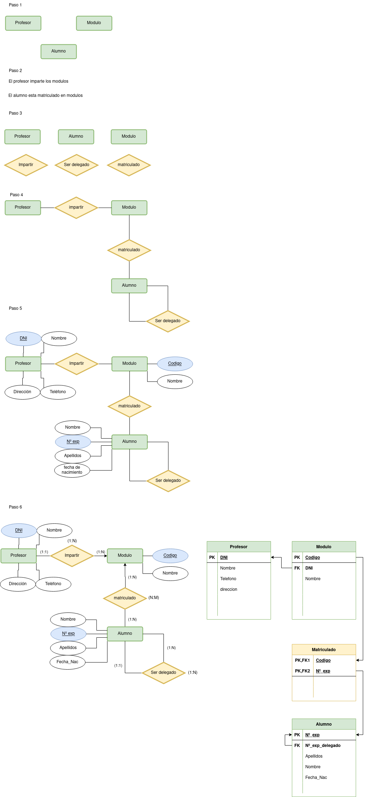
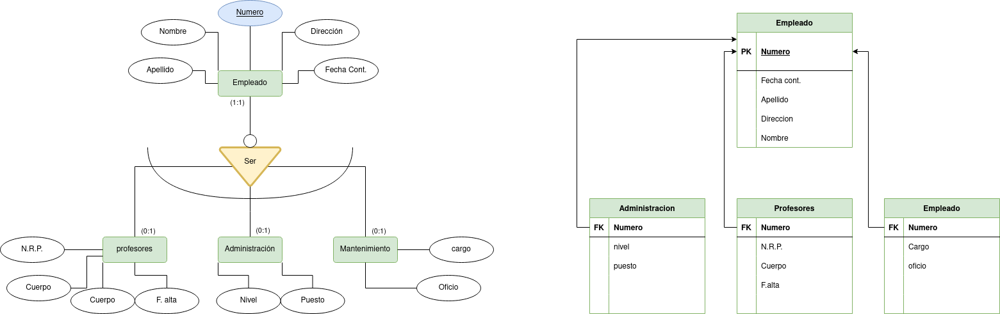
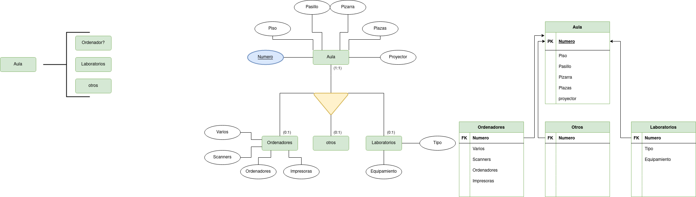
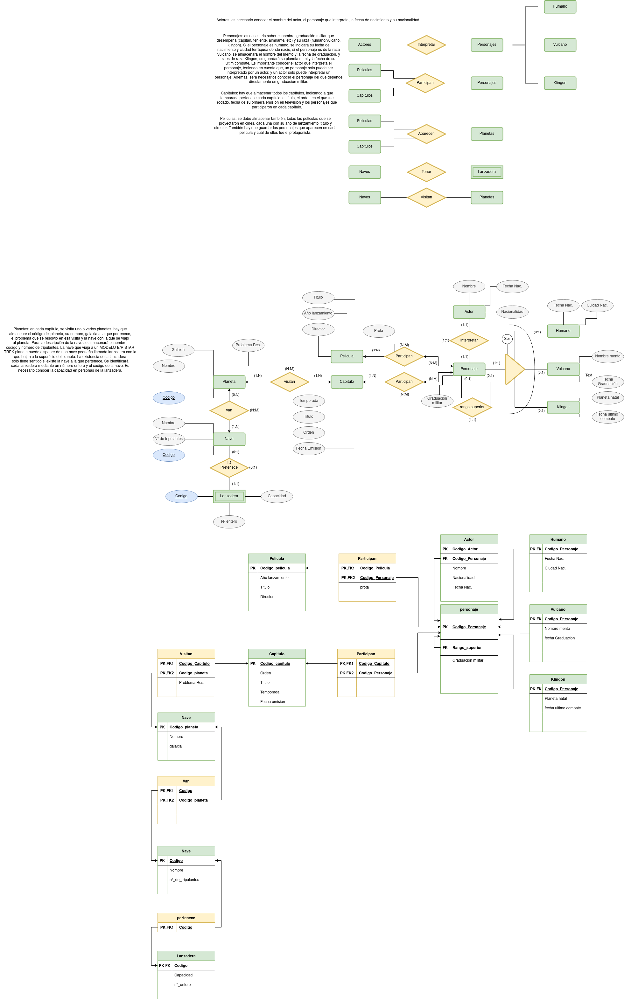
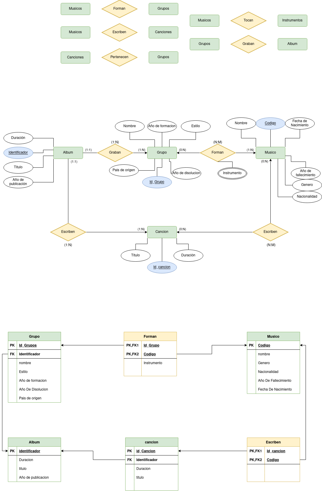
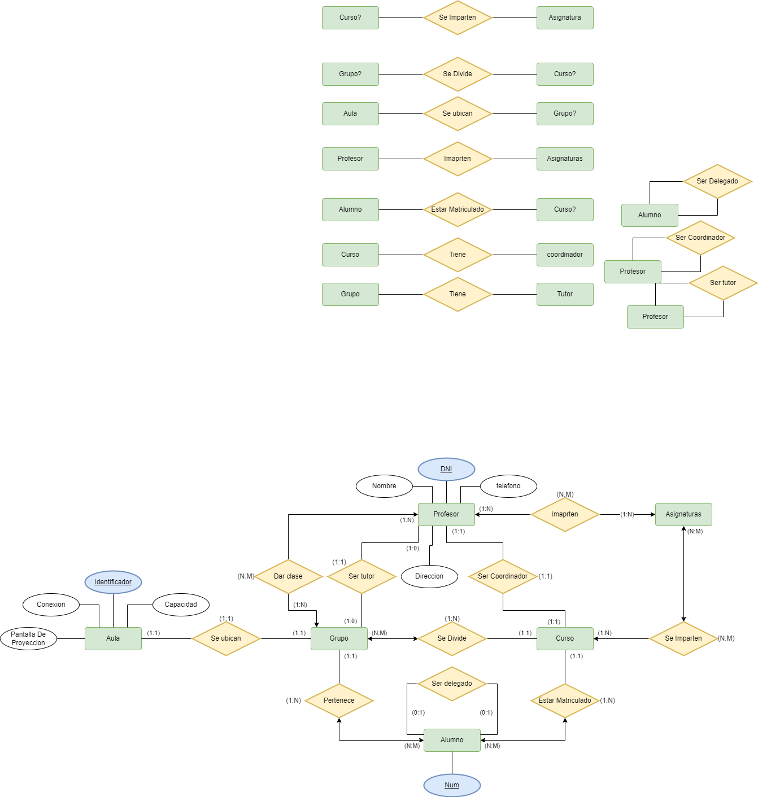

# Actividades 1-10
## Indice

[EJ_1](#id1)

[EJ_2](#id2)

[EJ_3](#id3)

[EJ_4](#id4)

[EJ_5](#id5)

[EJ_6](#id6)

[EJ_7](#id7)

[EJ_8](#id8)

[EJ_9](#id9)

[EJ_10](#id10)

[EJ_11](#id11)

[EJ_12](#id12)

### Tarea 1 

### Tarea 2 

Se desea realizar una BD que permita apoyar la gestión de un sistema de ventas. La empresa necesita llevar un control de proveedores, clientes, productos y ventas.

Un proveedor tiene un identificador, nombre, dirección, teléfono y página web.
Un cliente también tiene identificador, nombre, dirección, pero puede tener varios teléfonos de contacto. La dirección se entiende por calle, número, provincia y ciudad.
Un producto tiene un identificador único, nombre, precio actual, stock y nombre del proveedor. Además se organizan en categorías, y cada producto va sólo en una categoría. Una categoría tiene id, nombre y descripción.
Por razones de contabilidad, se debe registrar la información de cada venta con un id, fecha, cliente, descuento y monto final.
Además se debe guardar el precio al momento de la venta, la cantidad vendida y el monto total por el producto.

### Tarea 3 

Se desea crear una base de datos para una pequeña empresa debe contener información acerca de clientes, artículos y pedidos. Hasta el momento se registran los siguientes datos en documentos varios:

Para cada cliente: Número de cliente (único), Direcciones de envío (varias por cliente), Saldo, Límite de crédito (depende del cliente, pero en ningún caso debe superar los 3.000.000 €), Descuento.

Para cada artículo: Número de artículo (único), Fábricas que lo distribuyen, Existencias de ese artículo en cada fábrica, Descripción del artículo.

Para cada pedido: Cada pedido tiene una cabecera y el cuerpo del pedido. La cabecera está formada por el número de cliente, dirección de envío y fecha del pedido. El cuerpo del pedido son varias líneas, en cada línea se especifican el número del artículo pedido y la cantidad.

Además, se ha determinado que se debe almacenar la información de las fábricas. Sin embargo, dado el uso de distribuidores, se usará: Número de la fábrica (único) y Teléfono de contacto. Y se desean ver cuántos artículos (en total) provee la fábrica. También, por información estratégica, se podría incluir información de fábricas alternativas respecto de las que ya fabrican artículos para esta empresa.

### Tarea 4 

A partir del siguiente enunciado se desea realizar el modelo entidad-relación. Se desea informatizar la gestión de una empresa de reparto de mercancías que reparte paquetes por toda la isla. Los encargados de llevar los paquetes son los camioneros, de los que se quiere guardar el dni, nombre, teléfono, dirección, salario y población en la que vive. De los paquetes transportados interesa conocer el código de paquete, descripción, destinatario y dirección del destinatario. Un camionero distribuye muchos paquetes, y un paquete sólo puede ser distribuido por un camionero. De los camiones que llevan los camioneros, interesa conocer la matrícula, modelo, tipo y potencia. Un camionero puede conducir diferentes camiones en fechas diferentes, y un camión puede ser conducido por varios camioneros. Se solicita:

### Tarea 5 

A partir del siguiente enunciado se desea realizar el modelo entidad-relación.

“Se desea diseñar la base de datos de un Instituto. En la base de datos se desea guardar los datos de los profesores del Instituto (DNI, nombre, dirección y teléfono). Los profesores imparten módulos, y cada módulo tiene un código y un nombre. Cada alumno está matriculado en uno o varios módulos. De cada alumno se desea guardar el nº de expediente, nombre, apellidos y fecha de nacimiento. Los profesores pueden impartir varios módulos, pero un módulo sólo puede ser impartido por un profesor. Cada curso tiene un grupo de alumnos, uno de los cuales es el delegado del grupo”.

### Tarea 6 

“Se desea diseñar una base de datos para almacenar y gestionar la información empleada por una empresa dedicada a la venta de automóviles, teniendo en cuenta los siguientes aspectos: La empresa dispone de una serie de coches para su venta. Se necesita conocer la matrícula, marca y modelo, el color y el precio de venta de cada coche. Los datos que interesa conocer de cada cliente son el NIF, nombre, dirección, ciudad y número de teléfono: además, los clientes se diferencian por un código interno de la empresa que se incrementa automáticamente cuando un cliente se da de alta en ella. Un cliente puede comprar tantos coches como desee a la empresa. Un coche determinado solo puede ser comprado por un único cliente. El concesionario también se encarga de llevar a cabo las revisiones que se realizan a cada coche. Cada revisión tiene asociado un código que se incrementa automáticamente por cada revisión que se haga. De cada revisión se desea saber si se ha hecho cambio de filtro, si se ha hecho cambio de aceite, si se ha hecho cambio de frenos u otros. Los coches pueden pasar varias revisiones en el concesionario”.

### Tarea 7 

Para presentar los siguientes conceptos vamos a partir de un ejemplo de entidad que se encuentra en la mayoría de empresas: la entidad EMPLEADO. En la mayoría de empresas existen distintos tipos de empleados, cuya descripción es difícil de recoger utilizando una misma entidad.

Por ejemplo en un centro de enseñanza nos podemos encontrar con profesores, personal de administración, personal de limpieza y mantenimiento, etc. De los profesores, por ejemplo, tendremos que recoger información que no se requiere para el resto de personal. Por ejemplo: el número de registro personal, la especialidad, el cuerpo al que pertenece, la fecha de alta en el cuerpo, etc.

### Tarea 8 

Queremos recoger la información correspondiente a las aulas de un instituto de secundaria con la especialidad de informática:

De cada aula se quiere recoger la siguiente información: NºAula, Piso, Pasillo, Nº plazas. El número de aula es único y distinto para todas ellas.
Cuando las aulas son salas de ordenadores necesitamos saber: nº de ordenadores, escáner y nº de impresoras, así como otros equipamientos que pudieran instalarse.
Si se trata de laboratorios queremos saber el tipo (de ciencias, de idioma, etc.) y el equipamiento que tiene.
Todas las aulas, sean comunes, laboratorios o salas de ordenadores, pueden tener o no proyector y pizarra interactiva.
Existen otros tipos de aulas no recogidos en el modelo anterior como gimnasio, biblioteca, etc.
Cada aula se utiliza únicamente para las funciones que tiene asignadas (no se imparte una clase normal en un laboratorio, etc.)

### Tarea 9 

El club de Ajedrez IES Puerto, ha sido encargado por la Federación Internacional de Ajedrez de la organización de los próximos campeonatos mundiales que se celebrarán en la mencionada localidad. Por este motivo, desea llevar a una base de datos toda la gestión relativa a participantes, alojamientos y partidas. Teniendo en cuenta qué:

En el campeonato participan únicamente jugadores y árbitros; de ambos se requiere conocer el número de asociado, nombre, dirección, teléfono de contacto y campeonatos en los que han participado. De los jugadores se precisa además el nivel de juego en una escala de 1 a 10.
Ningún árbitro puede participar como jugador.
Los países envían al campeonato un conjunto de jugadores y árbitros, aunque no todos los países envían participantes. Todo jugador y árbitro es enviado por un único país. Un país puede ser representado por otro país.
Cada país se identifica por un número e interesa además conocer su nombre y el número de clubes de ajedrez existentes en el mismo.
Cada partida se identifica por un código ( Cod_P ), jugada por dos jugadores y arbitrada por un árbitro. Interesa registrar las partidas que juega cada jugador y el color ( blancas o negras ) con el que juega. Ha de tenerse en cuenta que un árbitro no puede arbitrar a jugadores enviados por el mismo país que le ha enviado a él.
Todo participante participa en al menos una partida.
Tanto jugadores como árbitros se alojan en uno de los hoteles en los que se desarrollan las partidas, se desea conocer en qué hotel y en qué fechas se ha alojado cada uno de los participantes. Los participantes pueden no permanecer en el Puerto durante todo el campeonato, sino acudir cuando tienen que jugar alguna partida alojándose en el mismo o distinto hotel. De cada hotel, se desea conocer el nombre, la dirección y el número de teléfono.
El campeonato se desarrolla a lo largo de una serie de jornadas (año, mes, día) y cada partida tiene lugar en una de las jornadas aunque no tengan lugar partidas todas las jornadas.
Cada partida se celebra en una de las salas de las que pueden disponer los hoteles, se desea conocer el número de entradas vendidas en la sala para cada partida. De cada sala, se desea conocer la capacidad y medios de que dispone (radio, televisión, vídeo...) para facilitar la retransmisión de los encuentros. Una sala puede disponer de varios medios distintos.
De cada partida se pretende registrar todos los movimientos que la componen, la identificación de movimiento se establece en base a un número de orden dentro de cada partida: para cada movimiento se guardan la jugaday un breve comentario realizado por un experto.

### Tarea 10 

Un club de fans de la famosa película Star Trek, ha decidido crear una página web donde se pueda consultar información referente a todas las películas y capítulos de la saga. El dominio startrekfans.com se redirigirá a un servidor web que consulte una base de datos con la siguiente información:

Actores: es necesario conocer el nombre del actor, el personaje que interpreta, la fecha de nacimiento y su nacionalidad.
Personajes: es necesario saber el nombre, graduación militar que desempeña (capitán, teniente, almirante, etc) y su raza (humano,vulcano, klingon). Si el personaje es humano, se indicará su fecha de nacimiento y ciudad terráquea donde nació, si el personaje es de la raza Vulcano, se almacenará el nombre del mento y la fecha de graduación, y si es de raza Klingon, se guardará su planeta natal y la fecha de su último combate. Es importante conocer el actor que interpreta el personaje, teniendo en cuenta que, un personaje sólo puede ser interpretado por un actor, y un actor sólo puede interpretar un personaje. Además, será necesarios conocer el personaje del que depende directamente en graduación militar.
Capítulos: hay que almacenas todos los capítulos, indicando a que temporada pertenece cada capítulo, el título, el orden en el que fue rodado, fecha de su primera emisión en televisión y los personajes que participaron en cada capítulo.
Películas: se debe almacenar también, todas las películas que se proyectaron en cines, cada una con su año de lanzamiento, título y director. También hay que guardar los personajes que aparecen en cada película y cuál de ellos fue el protagonista.
Planetas: en cada capítulo, se visita uno o varios planetas, hay que almacenar el código del planeta, su nombre, galaxia a la que pertenece, el problema que se resolvió en esa visita y la nave con la que se viajó al planeta. Para la descripción de la nave se almacenará el nombre, código y número de tripulantes. La nave que viaja a un planeta puede disponer de una nave pequeña llamada lanzadera con la que bajan a la superficie del planeta. La existencia de la lanzadera solo tiene sentido si existe la nave a la que pertenece. Se identificará cada lanzadera mediante un número entero y el código de la nave. Es necesario conocer la capacidad en personas de la lanzadera.

### Tarea 11 

Una empresa discográfica emergente de Canarias quiere almacenar y organizar eficientemente la información sobre grupos musicales, canciones y músicos. Para ello se hace necesario crear una base de datos que incluya los siguientes requerimientos y consideraciones:

Un Músico se identifica por un código de músico, su nombre, su fecha de nacimiento, su año de fallecimiento, su género y su nacionalidad.
Una Banda tiene un identificador de banda, el nombre del grupo, el año de formación, el año de disolución, el estilo musical y el país de origen. El estilo musical sólo puede tomar los valores:Blues, Country, Heavy, Jazz, Pop,Punk, Reggae ,Rock, Soul, Thrash, Techno.
Un Álbum se caracteriza por incluir un identificador de álbum, su título, el año de publicación, su duración y el identificador del grupo que lo ha grabado.
Una Canción almacena su identificador de canción, su título, su duración y el identificador del álbum al que pertenece.
Es necesario también mantener información sobre los músicos que forman parte, es decir, son miembros de un grupo o grupos musicales, así como del instrumento que toca el músico en el grupo, existiendo la posibilidad de que un músico toque más de un instrumento en un grupo.
Así mismo, también se debe disponer de información sobre las canciones y el músico o músicos que las han compuesto. En este sentido, como es lógico y habitual, un músico puede componer varias canciones y, también, una canción puede estar compuesta por más de un músico.

### Tarea 12 

Diseñar una Base de Datos para representar la información docente de un colegio, sabiendo que: La formación abarca ocho cursos (1º, 2º, 3º .. 8º) en los que se imparten diversas asignaturas, tales como Matemáticas, Física, Ciencias Naturales, Sociales, Dibujo, etc., dándose el caso de algunas asignaturas de distintos cursos que tienen el mismo nombre. Cada curso se reparte en varios grupos de alumnos a los que se asigna una letra: p.e. 3ºA, 2ºD, 5ºC, 1ºB, y se ubican en un aula fija para todo el curso. Las aulas, identificadas por un número, tienen una determinada capacidad de número de alumnos. De ellas interesa conocer, además, si disponen o no de conexión a la red de computadores del centro, y de pantalla para la proyección de transparencias. Los profesores del centro, de los que se dispone de su nombre y apellidos, DNI, dirección y teléfono, pueden impartir varias asignaturas distintas a grupos distintos. Además, cada curso tiene un profesor coordinador y cada grupo un profesor tutor. Acerca de los alumnos, además de su nombre y apellidos, dirección y teléfono, se desea reflejar el curso en que están matriculados y el grupo al que están asignados. También se desea representar qué alumno es el delegado de cada grupo. Como puede darse el caso, de alumnos con el mismo nombre y apellidos, cada alumno tiene asociado un (único) número de matrícula que facilita su identificación.

