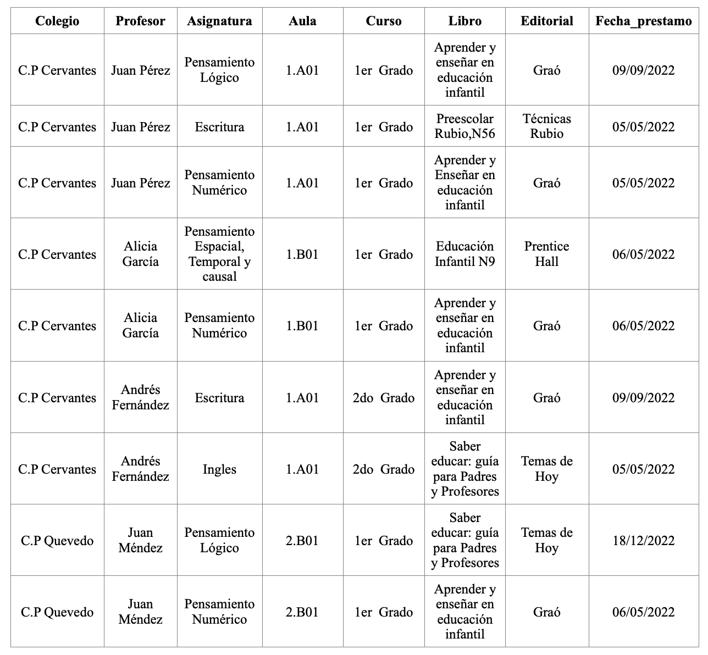

# Examen Normalizacion
## Centro Escolar

Dada la siguiente relación PRÉSTAMO (Colegio, Profesor,Asignatura, Aula, Curso, Libro, Editorial,Fecha_Préstamo) que contiene información relativa a los préstamos que realizan las editoriales a los profesores de primaria de los colegios para su evaluación en alguna de las asignaturas/habilidades que imparten. Se pide:

Considera las tuplas relación PRÉSTAMO mostradas en la tabla anterior, que a un profesor no se le puede prestar más de un libro de la misma editorial en el mismo día y que a un profesor no se le puede prestar más de una vez un mismo libro.

### Paso 1-2 ( 1FN )
La tabla no cumple la 1FN ya que hay valores no atomicos ( Profesor ) que se puede dividir en nombre y apellido.
**Profesor**
| id_profesor | nombre | apellido |
| ----------- | ------ | -------- |
| 1 | Juan | Pérez |
| 2 | Alicia | García |
| 3 | Andrés | Fernández |
| 4 | Juan | Méndez |

en esta tabla al no haber una clave primaria se genera una.

### Paso 3-4 ( 2FN )
Esta tabla no cumple la 2FN ya que no todos los valores tienen relación con la clave primaria. 

**Profesor**
| *id_profesor* | nombre | apellido |
| ------------- | ------ | -------- |
| 1 | Juan | Pérez |
| 2 | Alicia | García |
| 3 | Andrés | Fernández |
| 4 | Juan | Méndez |

**Libro**
| *cod_Libro* | titulo | editorial |
| ----------- | ------ | --------- |
| a | Aprender y enseñar en educación infantil | Graó |
| b | Preescolar Rubio,N56 | Técnicas Rubio |
| c | Aprender y enseñar en educación infantil | Graó |
| d | educación infantil N9 | Prentice Hall |
| e | Saber educar:guía para padres y profesores | Temas de Hoy |

**Asignatura**
| *id_Asignatura* | nombre |
| --------------- | ------ |
| A1 | Pensamiento Lógico |
| B2 | Escritura |
| C3 | Pensamiento Numérico |
| D4 | Pensamiento Espacial, Temporal y causal |
| E5 | Ingles |

**Colegio**
| *id_colegio* | nombre |
| ------------ | ------ |
| 132 | C.P Cervantes |
| 142 | C.P Quevedo |

**Aula**
| *nombre* | curso |
| -------- | ----- |
| 1.A01 | 1er Grado |
| 1.A01 | 2er Grado |
| 1.B01 | 1er Grado |
| 2.B01 | 1er Grado |

### Paso 5-6 ( 3FN )
El ejercicio si cumple la 3FN ya que no existe transitividad

### Paso 7-8 ( diagramas )

