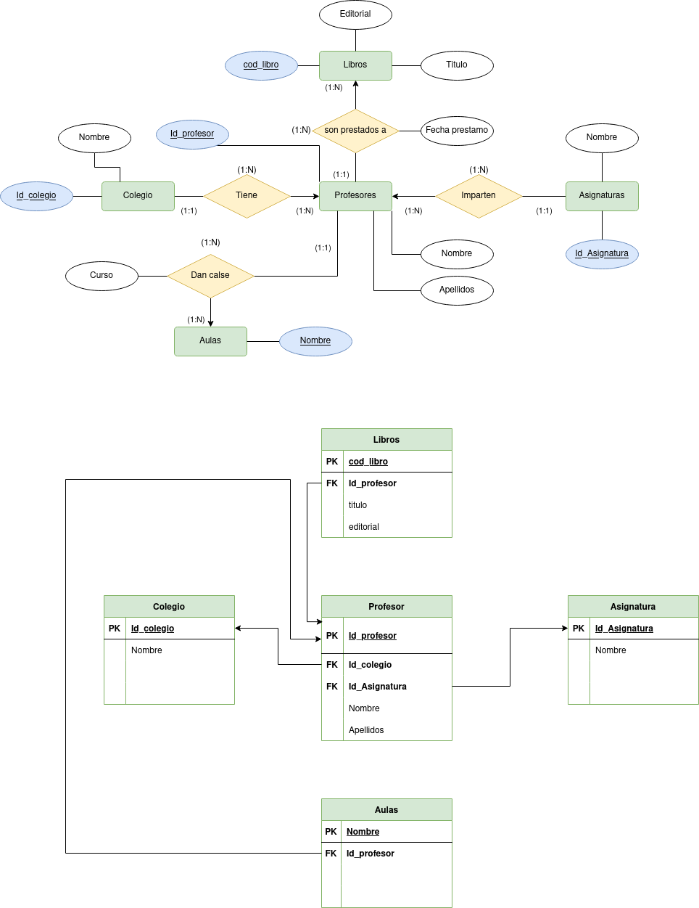

# Examen Normalizacion
## Centro Escolar

Dada la siguiente relación PRÉSTAMO (Colegio, Profesor,Asignatura, Aula, Curso, Libro, Editorial,Fecha_Préstamo) que contiene información relativa a los préstamos que realizan las editoriales a los profesores de primaria de los colegios para su evaluación en alguna de las asignaturas/habilidades que imparten. Se pide:

### Paso 1-2 ( 1FN )

### Paso 3-4 ( 2FN )

### Paso 5-6 ( 3FN )

### Paso 7-8 ( diagramas )

