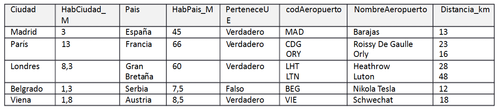

# Tarea 1
## Gestión de Aeropuertos
Se ha creado una base de datos con los datos de ciudades y sus aeropuertos. Los campos y los tipos de datos son los que se indican a continuación:

    Ciudad: Nombre de la ciudad (único).
    HabCiudad_M: número de habitantes de la ciudad en millones.
    País: País en el que se encuentra la ciudad.
    HabPais_M: Número de habitantes del país en millones.
    PerteneceUE: campo booleano. TRUE si el país Pertenece a la Unión Europea; FALSE, no pertenece a la Unión Europea.
    CodigoAeropuerto: único.
    NombreAeropuerto: único.
    Distancia_km: distancia del aeropuerto a la ciudad en km.
    
### Paso 1: 
   Las claves candidatas son: 
    -CodAeropuerto
    -NombreAeropuerto
    -Ciudad

### Paso 2:
  La 1FN no se cumple ya que los campos CodAeropuerto, NombreAeropuerto y Distancia_km ya que contienen varios valores.

  
### Paso 3:
  **Ciudad**
  | *Ciudad* | HabCiudad_M | Pais | HabPais_M | PerteneceUE |
  | -------- | ----------- | ---- | --------- | ----------- |
  | Madrid | 3 | España | 45 | Verdadero |
  | París | 13 | francia | 66 | Verdadero |
  | Londres | 8,3 | Gran Bretaña | 60 | Verdadero |
  | Belgrado | 1,3 | Serbia | 7,5 | Falso |
  | Viena | 1,8 | Austria | 8,5 | Verdadero |
  
  **Ciudad_Aeropuerto**
  | Ciudad | CodAeropuerto | Distancia_km |
  | ------ | ------------- | ------------ |
  | Madrid | MAD | 13 |
  | París | CDG | 23 |
  | París | ORY | 16 |
  | Londres | LHT | 28 |
  | Londres | LTN | 48 |
  | Belgrado | BEG | 12 |
  | Viena | VIE | 18 |
  
  **Aeropuerto**
  | *CodAeropuerto* | NombreAeropuerto |
  | --------------- | ---------------- |
  | MAD | Barajas |
  | CDG | Roissy De Gaulle |
  | ORY | Orly |
  | LHT | Heathrow |
  | LTN | Luto |
  | BEG | nikola Tesla |
  | VIE | Schwechat |

### Paso 4:
  La tabla resultado es la de Aeropuerto ya que todo va en relacion al suso dicho y contiene la FK , ciudad , para relacionarse con las tabla principal
    
### Paso 5:
  La clave primaria de la tabla generada seria el CodAeropuerto ya que es unico y no se repite.
