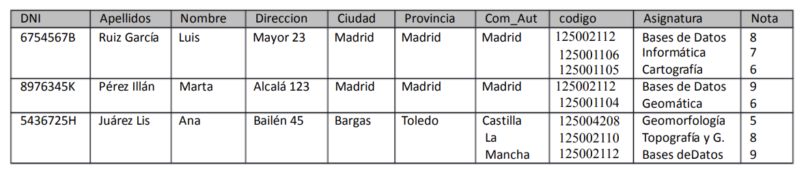

# Tarea 2
## Gestión Escuela de Topografía de Madrid
Se ha creado una base de datos para llevar las calificaciones de las asignaturas de los alumnos de primer curso de la Escuela de Topografía de Madrid. La tabla creada tiene los siguientes campos

    DNI varchar (20).
    Apellidos varchar (255).
    Nombre varchar (50).
    Direccion varchar (255).
    Ciudad varchar (50).
    Provincia varchar (50).
    Comunidad varchar (50).
    Codigo integer.
    Asignatura varchar(50).
    Nota double.

Además la información que se aporta es:

    DNI es un identificador único del alumno; lo mismo que {Apellidos, Nombre}.
    Ciudad es el nombre de la ciudad de residencia (único)
    Provincia es el nombre de la provincia de residencia (único)
    Com_Aut es el nombre de la Comunidad Autónoma de residencia (único)
    Codigo es el código de una asignatura (único). Asignatura es el nombre de la asignatura (único)
    Asignatura es el nombre de la asignatura (único)
    Nota es la nota que el alumno ha obtenido en la asignatura
    Codigo, Asignatura y Nota se escriben en el mismo orden en los campos correspondientes
    
### Paso 1: 
   Las claves candidatas son: 
    -DNI 
    -Codigo
    -Ciudad
    -Provincia
    -Com_Aut
    -Asignatura

### Paso 2:
  La 1FN no se cumple ya que los campos Codigo y DNI ya que contienen varios valores.

  
### Paso 3:
#### *1:N* 
  **Persona**
  | *DNI* | Apellidos | Nombre | Dirreccion | Ciudad | Provincia | Com_Aut |
  | ----- | --------- | ------ | ---------- | ------ | --------- | ------- |
  | 6754567B | Ruiz García | Luis | Mayor 23 | Madrid | Madrid | Madrid |
  | 8976345K | Pérez Illán | Marta | Alcalá 123 | Madrid | Madrid | Madrid |
  | 5436725H | juárez Lis | Ana | Bailén  45| Bargas | Toledo | Castilla de la Mancha |

  
  **Asignatura**
  | DNI | *Codigo* | Asignatura | Nota |
  | --- | -------- | ---------- | ---- |
  | 6754567B | 125002112 | Base de Datos | 8 |
  | 6754567B | 125001106 | Informática | 7 |
  | 6754567B | 125001105 | Cartografía | 6 |
  | 8976345K | 125002112 | Base de Datos | 9 |
  | 8976345K | 125001104 | Geomática | 6 |
  | 5436725H | 125004208 | Geomorfología | 5 |
  | 5436725H | 125002110 | Topografía y G. | 8 |
  | 5436725H | 125002112 | Base de Datos | 9 |

#### *N:M* 
  **Persona**
  | *DNI* | Apellidos | Nombre | Dirreccion | Ciudad | Provincia | Com_Aut |
  | ----- | --------- | ------ | ---------- | ------ | --------- | ------- |
  | 6754567B | Ruiz García | Luis | Mayor 23 | Madrid | Madrid | Madrid |
  | 8976345K | Pérez Illán | Marta | Alcalá 123 | Madrid | Madrid | Madrid |
  | 5436725H | juárez Lis | Ana | Bailén  45| Bargas | Toledo | Castilla de la Mancha |

  **Persona_Asignatura**
  | *DNI* | *Codigo* |
  | ----- | -------- |
  | 6754567B | 125002112 |
  | 6754567B | 125001106 |
  | 6754567B | 125001105 |
  | 8976345K | 125002112 |
  | 8976345K | 125002112 |
  | 5436725H | 125004208 |
  | 5436725H | 125002110 |
  | 5436725H | 125002112 |
  
  **Asignatura**
  | DNI | *Codigo* | Asignatura | Nota |
  | --- | -------- | ---------- | ---- |
  | 6754567B | 125002112 | Base de Datos | 8 |
  | 6754567B | 125001106 | Informática | 7 |
  | 6754567B | 125001105 | Cartografía | 6 |
  | 8976345K | 125002112 | Base de Datos | 9 |
  | 8976345K | 125001104 | Geomática | 6 |
  | 5436725H | 125004208 | Geomorfología | 5 |
  | 5436725H | 125002110 | Topografía y G. | 8 |
  | 5436725H | 125002112 | Base de Datos | 9 |

### Paso 4:
  La tabla resultado es la de Asignatura ya que todo va en relacion al suso dicho y contiene la FK , DNI , para relacionarse con las tabla principal
    
### Paso 5:
  La clave primaria de la tabla generada seria el Codigo ya que es unico y no se repite.
