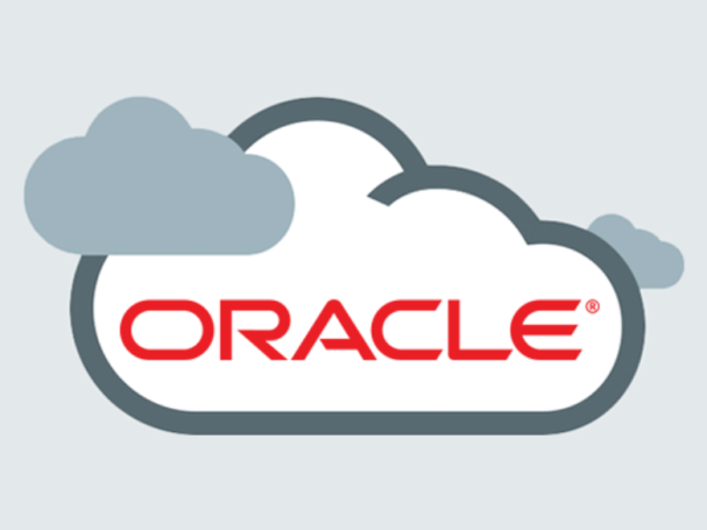
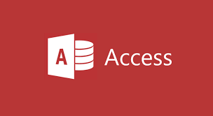
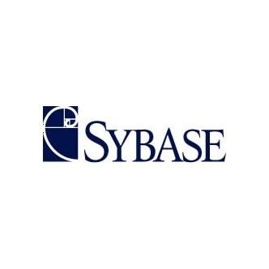
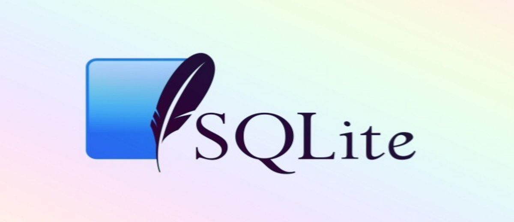

# Almacenamiento de la información Tarea 1
## Estrategias y Gestores de Base de Datos 

## indice

[Glosario](#id11)

[bibliografia](#id12)

[MySql](#id1)

[SQLServer](#id2)

[Oracle](#id3)

[Microsoft Access](#id4)

[PostgreSql](#id5)

[H2](#id6)

[FireBird](#id7)

[DB2](#id8)

[SYBASE](#id9)

[SQLite](#id10)

### Glosario 

- ¿ Que es una base de datos relacional ? 
    Una base de datos relacional es un tipo de base de datos que almacena y proporciona acceso a puntos de datos relacionados entre si. Las bases de datos relacionales se basan en el modelo relacional, una forma intuitiva y directa de representar datos en tablas.
    
 - ¿ Que son las sentencias SQL ?
     Las sentencias SQL son las que permiten a los usuarios realizar consultas, modificaciones, inserciones y procesos de eliminación de los datos que se hayan guardado en los distintos objetos que forman parte de la base de datos con la que estemos trabajando.  
     
 - ¿ Que son los procedimientos almacenados ?
     Un procedimiento almacenado es un programa almacenado fisicamente en una base de datos. Su implementación varia de un gestor de bases de datos a otro. La ventaja de un procedimiento almacenado
     
 - ¿ Que son las transacciones ?
     Una transacción es una interacción con una estructura de datos compleja, compuesta por varios procesos que se han de aplicar uno despues del otro.
     
 - ¿ Que es un sitema multiplataforma ?
     En informatica, se denomina multiplataforma a un atributo conferido a programas informáticos o metodos y conceptos de computo que son implementados, y operan internamente en multiples plataformas informaticas.

### MySql 

- MySQL es un sistema de base de datos relacional.

- El servidor de bases de datos MySQL soporta distintos tipos de sentencias :  Lisp , Perl , PHP , Python , Ruby , Gambas , REALbasic.

- Las bases de datos de MySQL soportan procedimientos almacenados.

- MySQL soporta transacciones.

- MySql es multiplataforma, funciona en una amplia lista de sistemas operativos.

- MySQL se suele utilizar en Linux , Unix , Windows.

### SqlServer 

- SQLServer es un sistema de gestión de bases de datos relacionales.

- SQL server soporta sentencias SQL.

- Las bases de datos de SQLServer soportan procedimientos almacenados.

- SQLServer soporta transacciones.

- SQLServer es multiplataforma.

- SQLServer se suele utilizar en Linux , Windows , Mac.

### Oracle 

- Oracle es un sistema de gestión de bases de datos relacionales.

- Oracle soporta sentencias SQL y PL.

- Las bases de datos de Oracle soportan procedimientos almacenados.

- Oracle soporta transacciones.

- Oracle es multiplataforma.

- Oracle se suele utilizar en Linux , Windows , Mac.

### Microsoft Access 

- Microsoft Access es un sistema de gestión de bases de datos relacionales.

- Microsoft Access soporta sentencias SQL , Excel , Outlook , ASCII , dBase , Paradox , FoxPro , Server , Oracle , ODBC.

- Las bases de datos de Microsoft Access soportan procedimientos almacenados.

- Microsoft Access soporta transacciones.

- Microsoft Access no es multiplataforma.

- Microsoft Access solo funciona en Windows.

### PostgreSql 

- PostgreSql es un sistema de gestión de bases de datos relacionales.

- PostgreSql soporta sentencias ODBC , JDBC , SQL , Pearl, TCL , Python.

- Las bases de datos de PostgreSql soportan procedimientos almacenados.

- PostgreSql soporta transacciones.

- PostgreSql es multiplataforma.

- PostgreSql se suele utilizar en Microsoft Windows , GNU/Linux , MacOS , BSD

### H2 

- H2 es un sistema de gestión de bases de datos relacionales.

- H2 soporta sentencias SQL , JDBC.

- Las bases de datos de H2 soportan procedimientos almacenados.

- H2 soporta transacciones.

- H2 es multiplataforma.

- H2 se suele utilizar en Widows XP o Vista , Mac OS X y Linux.

### FireBird 

- FireBird es un sistema de gestión de bases de datos relacionales.

- FireBird soporta sentencias JDBC , ODBC.

- Las bases de datos de FireBird soportan procedimientos almacenados.

- FireBird soporta transacciones.

- FireBird es multiplataforma.

- FireBird se suele utilizar en Windows , Linux , MacOS , HP-UX , AIX , Solaris y mas.

### DB2 

- DB2 es un sistema de gestión de bases de datos relacionales.

- DB2 soporta sentencias XML , PL , SQL.

- Las bases de datos de DB2 soportan procedimientos almacenados.

- DB2 soporta transacciones.

- DB2 es multiplataforma.

- DB2 se suele utilizar en Linux , UNIX y Windows.

### SYBASE 

- SYBASE es un sistema de gestión de bases de datos relacionales.

- SYBASE soporta sentencia SQL.

- Las bases de datos de SYBASE soportan procedimientos almacenados.

- SYBASE soporta transacciones.

- SYBASE es multiplataforma.

- SYBASE se suele utilizar en HP-UX , Microsoft Windows , AIX , Solaris , GNU/Linux , UNIX

### SQLite 

- SQLite es un sistema de gestión de bases de datos relacionales.

- SQLite soporta sentencia SQL , ava , Perl , Python , PHP , Ruby , C# , Pascal , SmallTalk , Clipper , Suneido , REXX , S-Lang.

- Las bases de datos de SQLite no soportan procedimientos almacenados.

- SQLite soporta transacciones.

- SQLite es multiplataforma.

- SQLite se suele utilizar Windows 95 , 98 , ME , 2000 , XP y Vista ; Windows CE & Pocket PC , Mac OSX , Linux , OpenEmbedded , PalmOS , Symbian.

#### bibliografia 
- Use wikipedia para sacar informacion de todos los tipos https://es.wikipedia.org/wiki/Wikipedia:Portada
- Tambien use el pdf del campus https://www3.gobiernodecanarias.org/medusa/eforma/campus/pluginfile.php/7157422/mod_resource/content/0/Pre_UD1_Almacenamiento%20de%20la%20información.pdf
- https://proximahost.es/blog/mysql-sistema-gestion-bases-datos/#:~:text=MySQL%20está%20escrito%20en%20su,accesible%20a%20todo%20el%20mundo.
- https://es.wikipedia.org/wiki/MySQL
- https://blog.mdcloud.es/sentencias-sql-tipos/#:~:text=Estas%20son%20las%20sentencias%20que,con%20la%20que%20estemos%20trabajando.
- https://es.wikipedia.org/wiki/Microsoft_SQL_Server
- https://www.cursosfemxa.es/blog/5-grandes-ventajas-de-oracle#:~:text=¿Cuáles%20son%20las%20características%20principales,la%20entrada%20a%20los%20datos.
- https://www.oracle.com/technetwork/es/documentation/317477-esa.pdf
- https://www.tecnologias-informacion.com/access.html#:~:text=Los%20usuarios%20pueden%20crear%20tablas,%2C%20Oracle%2C%20ODBC%2C%20etc.
- https://www.arsys.es/blog/postgresql-servidores
- https://www.adictosaltrabajo.com/2010/07/06/h-2-base-datos/
- https://hmong.es/wiki/H2_(DBMS)
- http://rafinguer.blogspot.com/2010/06/en-esta-ocasion-vamos-darle-una.html
- https://www.arsys.es/blog/firebird-bbdd
- https://sg.com.mx/revista/17/sqlite-la-base-datos-embebida
- https://angocadb2.blogspot.com/2012/06/log4db2-logging-in-sql-pl-db2.html#:~:text=En%20DB2%20se%20podría%20crear,para%20ser%20llamados%20sin%20esquema.
- https://www.iteramos.com/pregunta/13937/creacion-de-un-procedimiento-almacenado-y-sqlite
