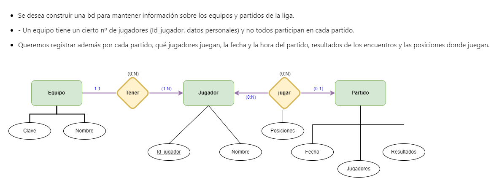
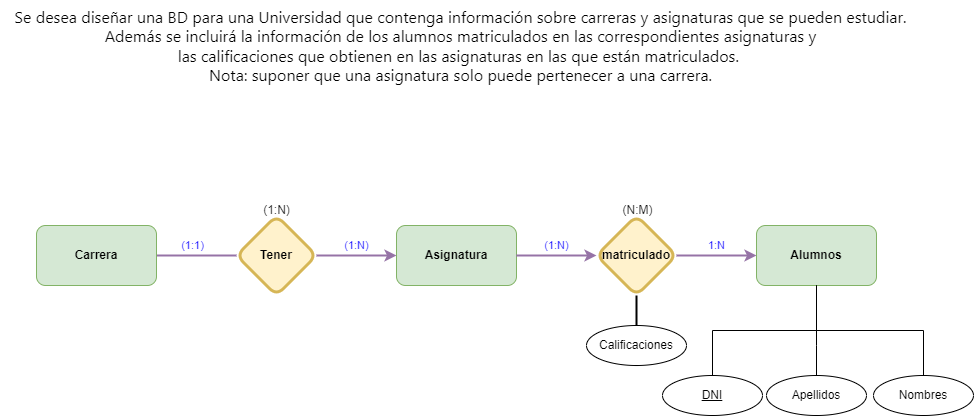

# Ejercicio Básico ER

## Indice

[EJ_1](#id1)

[EJ_2](#id2)

[EJ_3](#id3)

[EJ_4](#id4)

[EJ_5](#id5)

[EJ_6](#id6)

[EJ_7](#id7)

[EJ_8](#id8)

[EJ_9](#id9)

#Ejercicios

### EJ_1 

### EJ_2 

### EJ_3 

### EJ_4 

### EJ_5 

### EJ_6 

### EJ_7 

### EJ_8 

### EJ_9 

